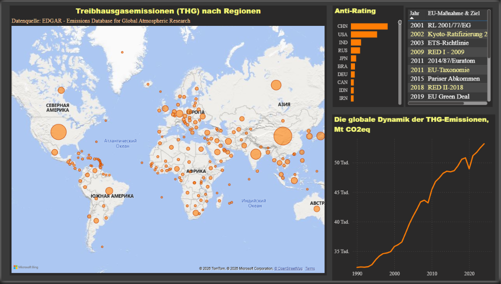
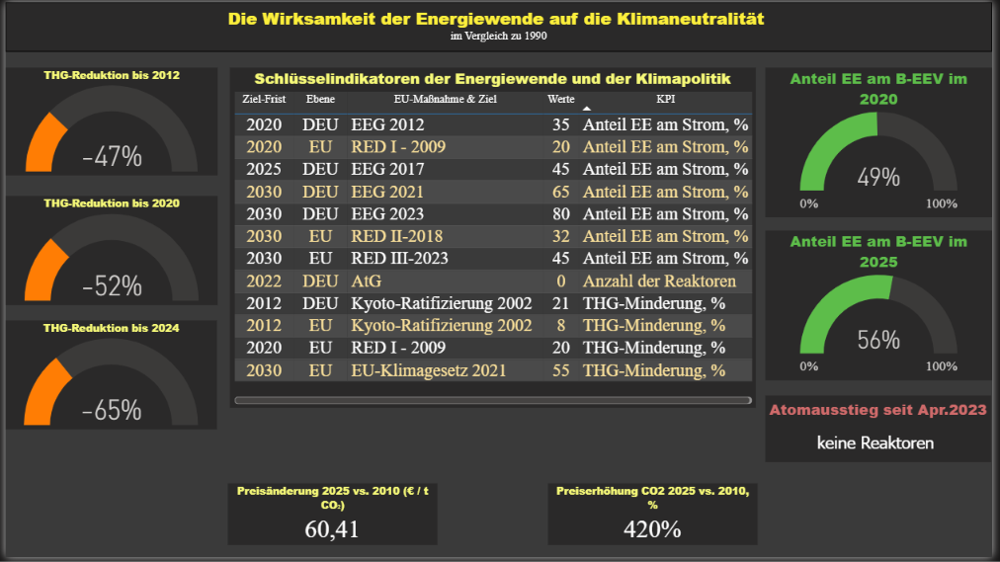

# Ökologische Aspekte der deutschen Energie- und Klimapolitik (1990–2024)

Power-BI-Bericht als **Teil III** eines Team-Abschlussprojekts im Kurs Data Analytics.

**Thema des Teams:** **Die Energiewende in Deutschland: wirtschaftliche, strukturelle und ökologische Aspekte**.

**Meine Rolle:** Konzeption, Datenmodell, Power Query, DAX und Visualisierung des ökologischen Teils. Der Bericht (`.pbix`) ist vollständig von mir erstellt. Einzelne **Tabellen** anderer Teamteile wurden nur geladen, um Zusammenhänge zu zeigen. Die Grafiken dazu (Seite 7) habe ich selbst gebaut.





## Bericht öffnen

Datei in [Power BI Desktop](https://www.microsoft.com/de-de/download/details.aspx?id=58494) öffnen:

`powerbi/III_oekologische_Aspekte_Sinienko_1990-2024.pbix`

## Fragestellung

1. Wie entwickeln sich Treibhausgasemissionen international und in Deutschland – und welche Klimaziele stehen dahinter?
2. Wie hängen Dekarbonisierung, Wirtschaft (BIP, Sektoren) und Energiewende zusammen?
3. Welche Lenkungswirkung hat der CO₂-Preis in der Energiewirtschaft, wenn ökologische und energiewirtschaftliche Daten verknüpft werden?


## Datenmodell (kurz)

Star Schema: Fakten zu THG, Bevölkerung und BIP; Dimensionen Land, Sektor, Substanz, Jahr; Kennzahlen in einer Measure-Tabelle. EU-Maßnahmen und KPI sind eigene Tabellen. Ausführlich: [`docs/02-data-model.md`](docs/02-data-model.md), Entstehung: [`docs/01-process.md`](docs/01-process.md).

**Eigene Daten:** Bevölkerung (OWID), BIP Deutschland (Statista), THG nach Ländern und Wirtschaftssektoren (EDGAR), Ziel-KPI und politische Maßnahmen (EU vs. Deutschland, selbst zusammengestellt).

**Teamdaten nur als Schnittstelle** (im Modell rot markiert): siehe [data/team-context/README.md](data/team-context/README.md). Zwei Visuals **von mir** verbinden CO₂-Preis / fossile Stromerzeugung mit meinen Sektordaten.

## Quellen

Eigene Rohdateien liegen unter [`data/raw/`](data/raw/).

| Daten im Modell | Datei | Quelle |
|---|---|---|
| Treibhausgasemissionen (Länder, Sektoren, Stoffe) | `data/raw/EDGAR_GHG.xlsx` | [EDGAR / JRC, Report 2025](https://edgar.jrc.ec.europa.eu/report_2025) |
| Bevölkerung (`fact_Bevölk`) | `data/raw/Abfrage1.xlsx`, **Blatt 1** | [Our World in Data: Population (long-run with projections)](https://ourworldindata.org/grapher/population-long-run-with-projections) — CSV-Export: [population-long-run-with-projections.csv](https://ourworldindata.org/grapher/population-long-run-with-projections.csv?v=1&csvType=full&useColumnShortNames=true) |
| BIP Deutschland 1999–2030 (`fact_BIP_DE_99-30`) | `data/raw/Abfrage1.xlsx`, **Blatt 2** | [Statista: Gross domestic product (GDP) in Germany](https://www.statista.com/statistics/375206/gross-domestic-product-gdp-in-germany/) |
| Politische Maßnahmen und KPI (EU und Deutschland getrennt) | `data/raw/politische Maßnahme.xlsx` | Kein einzelner Datensatz: selbst recherchiert und mit KI-Unterstützung als KPI-Katalog zusammengestellt (implementierte EU-Vorgaben vs. Umsetzung in Deutschland). Dient den Tabellen `dim_Ziel KPI`, `Ziel Maßnahme`, `E-Maßnahme`. |
| CO₂ der Stromerzeugung, Anteil EE, CO₂-Preis, Energieträger | nicht in `data/raw/` | [energy-charts.info](https://energy-charts.info/) (Fraunhofer ISE), Tabellen vom Team bereitgestellt — nur Schnittstelle, siehe [data/team-context/README.md](data/team-context/README.md) |

Verarbeitung: Power Query, Power BI Desktop, DAX.


## Werkzeuge

Power Query, Power BI Desktop, DAX.

## Hinweis zum Teamprojekt


| Teil | Inhalt                                   | Nicht in diesem Repo                   |
| ---- | ---------------------------------------- | -------------------------------------- |
| I    | Strukturelle Aspekte (Energiequellen)    | Tableau / SQL der Kolleginnen/Kollegen |
| II   | Ökonomische Aspekte (Strommarkt, Preise) | Python-Notebook und Marktdaten         |
| III  | Ökologische Aspekte                      | **dieser Bericht**                     |


## Ordner

```text
powerbi/              Power-BI-Datei
screenshots/          Seiten des Berichts und Datenmodell
docs/                 Prozess (01) und Datenmodell (02)
data/raw/             eigene Rohdaten (EDGAR, Bevölkerung + BIP in Abfrage1, Maßnahmen)
data/team-context/    Erklärung der Teamtabellen
```

